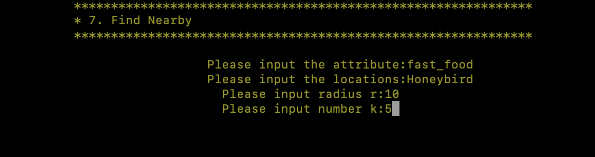

# EE538 Final Project - Spring 2022 - TrojanMap

## Authors: 

Smeet Dhakecha, Bhumi Godiwala <br>
dhakecha@usc.edu, godiwala@usc.edu

## TrojanMap

This project focuses on using data structures in C++ and implementing various graph algorithms to build a map application.

<p align="center"></p>

---

## The data Structure

Each point on the map is represented by the class **Node** shown below and defined in [trojanmap.h](src/lib/trojanmap.h).

```cpp
class Node {
  public:
    Node(){};
    Node(const Node &n){id = n.id; lat = n.lat; lon = n.lon; name = n.name; neighbors = n.neighbors; attributes = n.attributes;};
    std::string id;    // A unique id assign to each point
    double lat;        // Latitude
    double lon;        // Longitude
    std::string name;  // Name of the location. E.g. "Bank of America".
    std::vector<std::string> neighbors;  // List of the ids of all neighbor points.
    std::unordered_set<std::string> attributes;  // List of the attributes of the location.
};
```

---

## Run the program

Please run:

For MacOS,

```shell
$ bazel run src/main:main
```

For Ubuntu, you need to use the following command to prevent errors.
               
```shell
$ bazel run --cxxopt='-std=c++17' src/main:main
```

## Test the program

We have created some tests for you to test your program, please run
```shell
$ bazel test tests:trojanmap_test
```

Please add your tests in the [trojanmap_test_student.cc](tests/trojanmap_test_student.cc) and run

```shell
$ bazel test tests:trojanmap_test_student
```
Initial Screen
<p align="center"></p>

## Step 1: Autocomplete the location name

```c++
std::vector<std::string> Autocomplete(std::string name);
```

We consider the names of nodes as the locations. Implement a method to type the partial name of the location and return a list of possible locations with partial name as prefix. Please treat uppercase and lower case as the same character.

Example:

Input: "Chi" \
Output: ["Chick-fil-A", "Chipotle", "Chinese Street Food"]

Example:

<p align="center"></p>
<p align="center"></p>

## Step 2-1: Find the place's Coordinates in the Map

```c++
std::pair<double, double> GetPosition(std::string name);
```

Given a location name, return the latitude and longitude. There are no duplicated location names. You should mark the given locations on the map. If the location does not exist, return (-1, -1). The algorithm is case-sensitive.

Example:

Input: "Target" \
Output: (34.0257016, -118.2843512)

<p align="center"></p>
<p align="center"></p>
<p align="center"></p>

## Step 2-2: Check edit distance between two location names

```c++
int CalculateEditDistance(std::string name1, std::string name2);
```

When entering a location name that does not exist in the map, the map will determine whether the input can be replaced with a "similar name" or not. Similar names refer to the names that exist in the map with a smallest distance from the original input. The distance between two names A and B is the minimum number of operations required to convert A to B. There are 3 operations:
+ Insert a character
+ Delete a character
+ Replace a character

If the exact match is found, it will be shown on the map. Otherwise, the map will show the most similar name by using FindClosestName and print a warning. For example, if I type Rolphs, I should get a warning like "Did you mean Ralphs instead of Rolphs?"

Example:

Input: "Rolphs", "Ralphs" \
Output: 1

```c++
std::string FindClosestName(std::string name);
```

Example:

Input: "Rolphs"\
Output: "Ralphs"

<p align="center"></p>
<p align="center"></p>

## Step 3: CalculateShortestPath between two places

```c++
std::vector<std::string> CalculateShortestPath_Dijkstra(std::string &location1_name,
                                               std::string &location2_name);
std::vector<std::string> CalculateShortestPath_Bellman_Ford(std::string &location1_name,
                                               std::string &location2_name);
```

Given 2 locations A and B, it finds the best route from A to B. The distance between 2 points is the euclidean distance using latitude and longitude.  

Example:

Input: "Ralphs", "ChickfilA" \
Output: ["2578244375", "5559640911", "6787470571", "6808093910", "6808093913", "6808093919", "6816831441",
      "6813405269", "6816193784", "6389467806", "6816193783", "123178876", "2613117895", "122719259",
      "2613117861", "6817230316", "3642819026", "6817230310", "7811699597", "5565967545", "123318572",
      "6813405206", "6813379482", "544672028", "21306059", "6813379476", "6818390140", "63068610", 
      "6818390143", "7434941012", "4015423966", "5690152766", "6813379440", "6813379466", "21306060",
      "6813379469", "6813379427", "123005255", "6807200376", "6807200380", "6813379451", "6813379463",
      "123327639", "6813379460", "4141790922", "4015423963", "1286136447", "1286136422", "4015423962",
      "6813379494", "63068643", "6813379496", "123241977", "4015372479", "4015372477", "1732243576",
      "6813379548", "4015372476", "4015372474", "4015372468", "4015372463", "6819179749", "1732243544",
      "6813405275", "348121996", "348121864", "6813405280", "1472141024", "6813411590", "216155217", 
      "6813411589", "1837212103", "1837212101", "6820935911", "4547476733"]


<p align="center"></p>
<p align="center"></p>
<p align="center"></p>


## Step 4: The Travelling Trojan Problem (AKA Travelling Salesman!)

In this section, we assume that we are using a UAV which means we can fly directly from 1 point to another point. Given a vector of location ids, assume every location can reach all other locations in the vector (i.e. assume that the vector of location ids is a complete graph).
It finds the shortest route that covers all the locations exactly once and goes back to the start point.  

We will use the following algorithms:

- Brute-force (i.e. generating all permutations, and returning the minimum)
```c++
std::pair<double, std::vector<std::vector<std::string>>> TravellingTrojan_Brute_force(
      std::vector<std::string> location_ids);
```
- Brute-force enhanced with early backtracking
```c++
std::pair<double, std::vector<std::vector<std::string>>> TravellingTrojan_Backtracking(
      std::vector<std::string> location_ids);
```
- [2-opt Heuristic](https://en.wikipedia.org/wiki/2-opt). Also see [this paper](http://cs.indstate.edu/~zeeshan/aman.pdf)
```c++
std::pair<double, std::vector<std::vector<std::string>>> TravellingTrojan_2opt(
      std::vector<std::string> location_ids);
```

We use early backtracking when the current cost is higher than current minimum.

Please report and compare the time spent by these 3 algorithms. 2-opt algorithm may not get the optimal solution. Please show how far your solution is from the optimal solution.

Show the routes on the map. For each intermediate solution, create a new plot. Your final video presentation should include the changes to your solution.

We will randomly select N points in the map and run your program.


<p align="center"></p>
<p align="center"></p>
<p align="center"></p>

BruteForce
<p align="center"></p>
Early Backtracking
<p align="center"></p>
2 opt
<p align="center"></p>

## Step 5: Cycle Detection

```c++
bool CycleDetection(std::vector<double> &square);
```

In this section, we use a square-shaped subgraph of the original graph by using four coordinates stored in ```std::vector<double> square```, which follows the order of left, right, upper, and lower bounds. 

Then try to determine if there is a cycle path in the that subgraph. If it does, return true and report that path on the map. Otherwise return false.

Example 1:
```shell
Input: square = {-118.299, -118.264, 34.032, 34.011}
Output: true
```

Here we use the whole original graph as our subgraph. 
<p align="center"></p>
<p align="center"></p>
<p align="center"></p>


Example 2:
```shell
Input: square = {-118.290, -118.289, 34.030, 34.020}
Output: false
```

Here we use a square area inside USC campus as our subgraph
<p align="center"></p>
<p align="center"></p>
<p align="center"></p>

## Step 6: Topological Sort

```c++
std::vector<std::string> DeliveringTrojan(std::vector<std::string> &location_names,
                                            std::vector<std::vector<std::string>> &dependencies);
```
In this section, we assume that we are using a UAV which means we can fly directly from 1 point to another point. Tommy Trojan got a part-time job from TrojanEats, for which he needs to pick up and deliver food from local restaurants to various location near the campus. Tommy needs to visit a few different location near the campus with certain order, since there are some constraints. For example, he must first get the food from the restaurant before arriving at the delivery point. 

The TrojanEats app will have some instructions about these constraints. So, Tommy asks you to help him figure out the feasible route!

Here we will give you a vector of location names that Tommy needs to visit, and also some dependencies between those locations.


For example, 

```shell
Input: 
location_names = {"Ralphs", "Chick-fil-A", "KFC"}
dependencies = {{"Ralphs","KFC"}, {"Ralphs","Chick-fil-A"}, {"Chick-fil-A", "KFC"}}
```

Here, ```{"Ralphs","KFC"}``` means
that Tommy must go to `Ralphs` prior to `KFC`.

Your output should be:
```shell
Output: Ralphs  -> Chick-fil-A -> KFC
```

<p align="center"></p>
<p align="center"></p>
<p align="center"></p>

## Step 7: Find Nearby

Given a attribute name C, a location name L and a number r and k, this finds at most k locations in attribute C on the map near L(do not include L) with the range of r and returns a vector of string ids. The order of locations should from
nearest to farthest.

```c++
std::vector<std::string> TrojanMap::FindNearby(std::string attributesName, std::string name, double r, int k);
```
All attributes
```
'artwork', 'attraction', 'bakery', 'bank', 'bar', 'beauty', 'beverages', 'bicycle', 'bicycle_rental', 'bus_station', 'cafe', 'car', 'car_repair', 'car_wash', 'charging_station', 'childcare', 'clinic', 'clothes', 'confectionery', 'convenience', 'copyshop', 'dentist', 'department_store', 'driving_school', 'fabric', 'fast_food', 'food_court', 'fountain', 'fuel', 'gallery', 'hairdresser', 'hospital', 'hotel', 'library', 'marketplace', 'mobile_phone', 'museum', 'music', 'optician', 'parcel_locker', 'parking', 'pharmacy', 'place_of_worship', 'police', 'post_office', 'restaurant', 'school', 'shoe_repair', 'shoes', 'skate', 'social_facility', 'supermarket', 'theatre', 'tobacco', 'yes', 'yoga'
```


<p align="center"></p>
<p align="center"></p>
<p align="center"></p>

